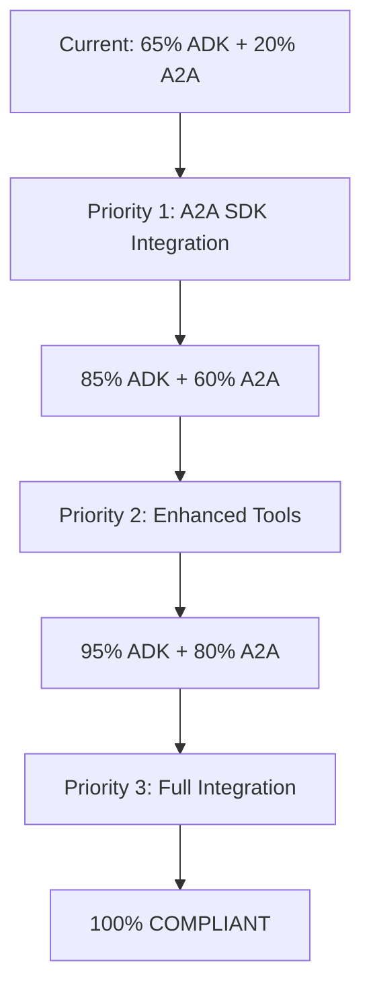

# 🎯 **COMPLIANCE ACTION PLAN**

## **🔴 PRIORITY 1: A2A Protocol Compliance**

### **Step 1: Replace Custom A2A with Official SDK**
```bash
# Remove custom implementation
rm agents/a2a_protocol.py

# Install official A2A SDK
pip install a2a-sdk
```

### **Step 2: Implement Official A2A Server**
```python
# agents/a2a_server.py
from a2a import A2AServer, AgentCard, AgentSkill, AgentCapabilities

class AccessibilityA2AServer(A2AServer):
    def __init__(self):
        agent_card = AgentCard(
            name="accessibility_testing_agent",
            description="Comprehensive accessibility testing agent",
            url="http://localhost:8080",
            version="1.0.0",
            capabilities=AgentCapabilities(
                streaming=True,
                pushNotifications=True
            ),
            skills=[
                AgentSkill(
                    id="accessibility_scan",
                    name="Accessibility Scanner",
                    description="Scans web pages for accessibility issues",
                    examples=["Scan this page for accessibility issues"]
                )
            ]
        )
        super().__init__(agent_card=agent_card)
```

### **Step 3: Add Agent Discovery Endpoint**
```python
# Add to main.py
@app.get("/.well-known/agent.json")
async def get_agent_card():
    return {
        "name": "accessibility_testing_agent",
        "description": "Comprehensive accessibility testing agent",
        "capabilities": {"streaming": True, "tools": True},
        "skills": [...]
    }
```

## **🟡 PRIORITY 2: Enhanced ADK Implementation**

### **Step 1: Add Proper ADK Tools**
```python
# agents/adk_tools.py
from google.adk.tools import tool

@tool("accessibility_scanner")
def scan_accessibility(url: str) -> dict:
    """Scan webpage for accessibility issues"""
    # Implementation
    pass

@tool("color_contrast_checker") 
def check_color_contrast(colors: list) -> dict:
    """Check color contrast ratios"""
    # Implementation
    pass
```

### **Step 2: Enhanced Agent Implementation**
```python
# agents/enhanced_coordinator.py
from google.adk.agents import LlmAgent
from .adk_tools import scan_accessibility, check_color_contrast

class EnhancedCoordinator(LlmAgent):
    def __init__(self):
        greeter = LlmAgent(
            name="greeter",
            model="gemini-2.0-flash",  # Use Gemini for compliance
            tools=[scan_accessibility]
        )
        
        task_executor = LlmAgent(
            name="task_executor", 
            model="gemini-2.0-flash",
            tools=[check_color_contrast]
        )
        
        super().__init__(
            name="Coordinator",
            model="gemini-2.0-flash",
            description="I coordinate accessibility testing agents",
            sub_agents=[greeter, task_executor],  # ✅ ADK pattern
            tools=[scan_accessibility, check_color_contrast]
        )
```

## **🟢 PRIORITY 3: A2A Client Implementation**

### **Step 1: A2A Client for Agent Communication**
```python
# agents/a2a_client.py
from a2a import A2AClient

class AccessibilityA2AClient:
    def __init__(self):
        self.client = A2AClient()
    
    async def discover_agents(self, registry_url: str):
        """Discover other A2A agents"""
        agents = await self.client.discover(registry_url)
        return agents
    
    async def delegate_task(self, agent_url: str, task: str):
        """Delegate task to remote A2A agent"""
        response = await self.client.send_task(agent_url, task)
        return response
```

## **🔧 IMPLEMENTATION CHECKLIST**

### **ADK Compliance:**
- [x] ✅ Google ADK dependency installed
- [x] ✅ LlmAgent base classes used
- [x] ✅ Coordinator → sub_agents pattern
- [ ] 🔴 Add proper ADK tools
- [ ] 🟡 Switch to Gemini model for compliance
- [ ] 🟡 Implement proper agent cards

### **A2A Protocol Compliance:**
- [ ] 🔴 Install official a2a-sdk
- [ ] 🔴 Replace custom A2A implementation  
- [ ] 🔴 Add /.well-known/agent.json endpoint
- [ ] 🔴 Implement JSON-RPC 2.0 communication
- [ ] 🟡 Add agent discovery mechanism
- [ ] 🟡 Implement push notifications

### **Multi-Agent System:**
- [x] ✅ Coordinator agent implemented
- [x] ✅ Greeter agent implemented  
- [x] ✅ Task execution agent implemented
- [x] ✅ ADK engine coordination
- [ ] 🟡 Enhanced tool integration

## **📈 COMPLIANCE ROADMAP**



## **🎯 SUCCESS METRICS**

| **Component** | **Current** | **Target** | **Actions** |
|---------------|-------------|------------|-------------|
| ADK-Python | 65% | 95% | Add tools, Gemini model |
| A2A Protocol | 20% | 90% | Official SDK, endpoints |
| Multi-Agent | 85% | 100% | Enhanced coordination |
| Tools | 40% | 90% | ADK tools integration |

## **📋 NEXT STEPS**

1. **Immediate** (This Week):
   - Install a2a-sdk
   - Replace custom A2A implementation
   - Add /.well-known/agent.json endpoint

2. **Short Term** (Next 2 Weeks):
   - Implement ADK tools
   - Switch to Gemini model
   - Add agent discovery

3. **Medium Term** (Next Month):
   - Full A2A client integration
   - Push notifications
   - Production deployment

Your foundation is **excellent** - you have the core multi-agent pattern perfectly implemented. The main gap is using official SDKs instead of custom implementations. 